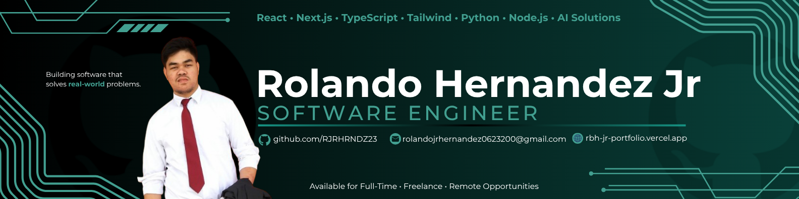

  

---

I am a Software Developer based in the Philippines, passionate about building modern, user-focused web applications that solve real-world problems.

I have experience in inventory management and material planning from my previous job, which gave me a strong understanding of both business processes and practical operations.

Now, I am currently focusing on software development. I specialize in React and Next.js, developing responsive and efficient web applications with a focus on performance, usability, and clean design.

---

## Tech Stack

  

* Frontend: HTML, CSS, JavaScript, TypeScript, Tailwind
* Backend: Nodejs, PHP, Python, C#, REST API
* Database: MySQL, MSSQL, MongoDB, PostgreSQL, Supabase
* Framework: React, Next.js, Express.js, .Net
* Development Tools: VS Code, Visual Studio 2022, Github, Postman, npm/yarn, Render, Vercel
* AI & Data Science: PyTorch, Tensorflow, Pandas, Numpy, Matplotlib, Scikit-Learn, Imbalanced-Learn, Supervised Learning, Unsupervised Learning, YOLO
* Focus: Clean architecture + great user experience

---

## Social Media

  
  
  

---

*"Build Smart. Scale Fast. Stand Out."*
